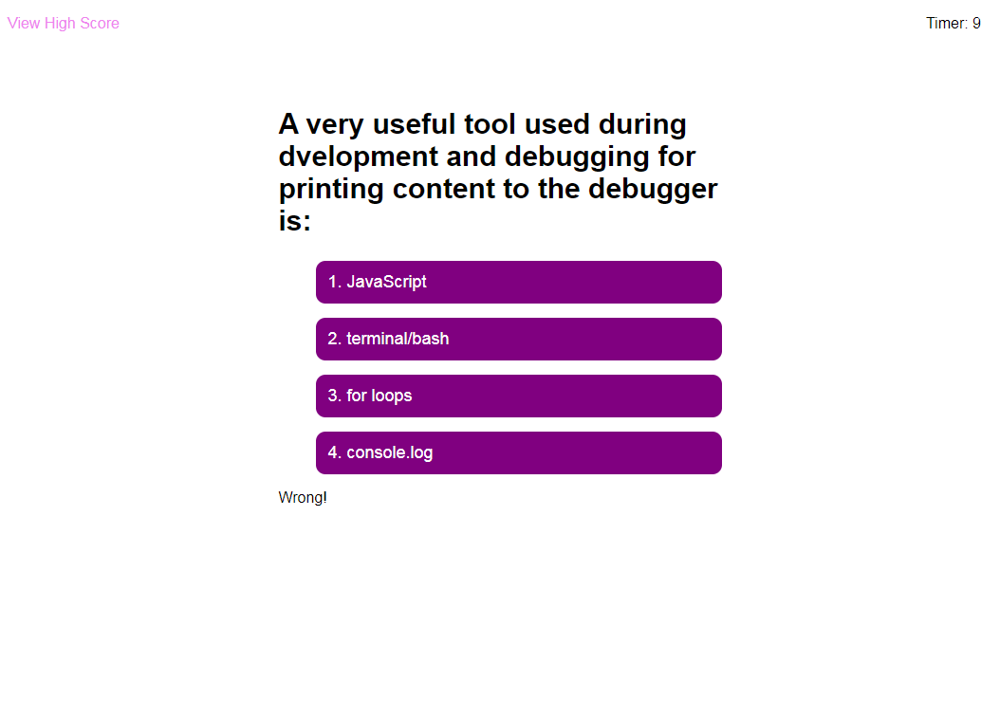

# Web Api Challenge: Code Quiz - by Zhanzhan Liu

## Purpose
This week’s Challenge invites you to build a timed coding quiz with multiple-choice questions. This app will run in the browser, and will feature dynamically updated HTML and CSS powered by JavaScript code that you write. It will have a clean, polished, and responsive user interface.

## Build with
* HTML
* CSS
* JavaScript

## Website
https://zhanzhanliu.github.io/code-quiz/

## Respository Link
https://github.com/zhanzhanLiu/code-quiz

## Screenshots of application

## Future Work (Issues)
As time is limited for me this week, the application has the following issues needed to be fixed: 
* High score board needs to imporve to store multiple user data
* Timer of the second time quiz runs faster
* Improve outlook through CSS
